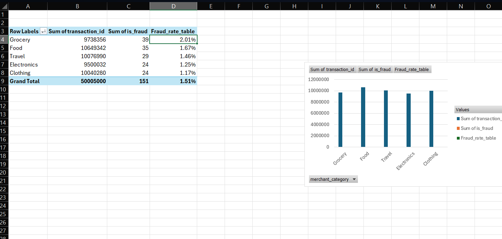
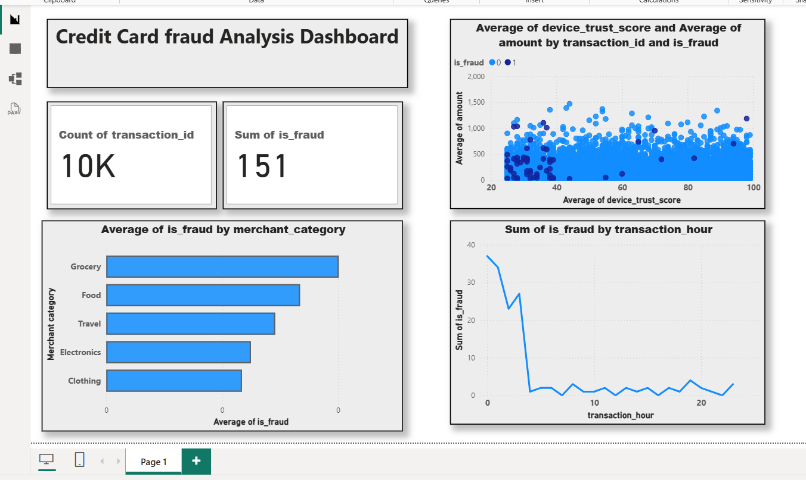

# Credit Card Fraud Analysis

A data analysis project exploring fraud patterns in a 10,000-row credit card transaction dataset using **Excel**, **SQL**, and **Power BI**.

## 📌 Project Overview

This project analyzes transaction-level data to identify patterns and risk indicators associated with fraudulent credit card activity. The goal was to practice a full analyst workflow — data cleaning, exploratory analysis, SQL querying, and dashboard building — end to end on a realistic dataset.

## 🗂️ Dataset

- **Source:** Kaggle (Credit Card Fraud dataset, 10,000 transactions)
- **Rows:** 10,000
- **Columns:** transaction_id, amount, transaction_hour, merchant_category, foreign_transaction, location_mismatch, device_trust_score, velocity_last_24h, cardholder_age, is_fraud
- **Fraud cases:** 151 out of 10,000 (1.51% of all transactions)

## 🛠️ Tools Used

- **Excel** – data exploration, pivot tables, initial cleaning
- **SQL (MySQL)** – filtering, aggregation, joins, subqueries, window functions
- **Power BI** – interactive dashboard and visualizations

## 1️⃣ Excel Analysis

1. Loaded the raw `credit_card_fraud_10k.csv` dataset into Excel and reviewed all 10 columns for completeness (no nulls or duplicates found).
2. Built a **Pivot Table** to break down transactions by `merchant_category`, summarizing total transaction count and total fraud cases per category.
3. Added a second instance of `is_fraud` to the pivot table's Values area, changed its summary type to **Average**, and formatted it as a percentage to calculate the **fraud rate per category**.
4. Sorted the pivot table by fraud rate (largest to smallest) to identify the highest-risk category.

### Fraud Rate by Merchant Category

| Merchant Category | Fraud Count | Fraud Rate |
|---|---|---|
| **Grocery** | 39 | **2.01%** |
| Food | 35 | 1.67% |
| Travel | 29 | 1.46% |
| Electronics | 24 | 1.25% |
| Clothing | 24 | 1.17% |
| **Overall** | 151 | 1.51% |

**Insight:** Grocery transactions had the highest fraud rate (2.01%) despite not having the highest transaction volume, while Clothing had the lowest (1.17%). This suggests fraud monitoring rules could prioritize grocery transactions for additional verification, rather than assuming higher-value categories like Electronics or Travel carry the most risk.



## 2️⃣ SQL Analysis

Imported the dataset into MySQL and wrote queries covering filtering, aggregation, subqueries, window functions, and a join against a small supplementary risk-notes table.

```sql
-- Fraud rate by merchant category (validates the Excel pivot table)
SELECT merchant_category,
       COUNT(*) AS total_txns,
       SUM(is_fraud) AS fraud_txns,
       ROUND(SUM(is_fraud) * 100.0 / COUNT(*), 2) AS fraud_rate_pct
FROM transactions
GROUP BY merchant_category
ORDER BY fraud_rate_pct DESC;
```

```sql
-- Average device trust score: fraud vs legitimate transactions
SELECT is_fraud, ROUND(AVG(device_trust_score), 2) AS avg_trust_score
FROM transactions
GROUP BY is_fraud;
```

```sql
-- Window function: rank fraud cases by amount within each category
SELECT transaction_id, merchant_category, amount, is_fraud,
       RANK() OVER (PARTITION BY merchant_category ORDER BY amount DESC) AS amount_rank
FROM transactions
WHERE is_fraud = 1;
```

```sql
-- CTE + subquery: categories with an above-average fraud rate
WITH category_fraud AS (
    SELECT merchant_category,
           COUNT(*) AS total_txns,
           SUM(is_fraud) AS fraud_txns,
           SUM(is_fraud)/COUNT(*) AS fraud_rate
    FROM transactions
    GROUP BY merchant_category
)
SELECT * FROM category_fraud
WHERE fraud_rate > (SELECT AVG(fraud_rate) FROM category_fraud);
```

```sql
-- JOIN: combine transactions with a merchant category risk-notes table
SELECT t.merchant_category,
       COUNT(*) AS total_txns,
       SUM(t.is_fraud) AS fraud_txns,
       r.risk_level,
       r.recommended_action
FROM transactions t
JOIN category_risk_notes r ON t.merchant_category = r.merchant_category
GROUP BY t.merchant_category, r.risk_level, r.recommended_action
ORDER BY fraud_txns DESC;
```

**Key SQL insights:**
- Fraud results from SQL matched the Excel pivot table exactly, confirming Grocery as the highest-risk category.
- The window function identified the single highest-value fraud transaction within each merchant category, useful for spotting high-loss outliers rather than just high-frequency categories.
- The CTE/subquery isolated Grocery and Food as the only two categories with an above-average fraud rate (1.51%).
- The JOIN combined transaction data with a business risk-notes table, simulating how an analyst would merge raw data with internal risk classifications.

See [`fraud_analysis_queries.sql`](fraud_analysis_queries.sql) for the full query set.

## 3️⃣ Power BI Dashboard

Built an interactive 4-visual dashboard summarizing overall fraud volume, fraud rate by category, transaction risk patterns, and fraud timing.

**Dashboard includes:**
- **Summary cards** – Total transactions (10,000) and total fraud cases (151)
- **Bar chart** – Fraud rate by merchant category (confirms Grocery as highest-risk)
- **Scatter plot** – Device trust score vs. transaction amount, colored by fraud status — fraudulent transactions (dark blue) cluster more heavily toward lower trust scores (roughly 20-60 range) than legitimate ones
- **Line chart** – Fraud cases by hour of day — fraud is heavily concentrated in the **early morning hours (12 AM-3 AM)**, dropping sharply afterward and staying low for the rest of the day

**Insight:** Combining the SQL and Power BI findings, fraud risk is highest for grocery transactions made with low device trust scores during early morning hours — a pattern that could inform a targeted, rules-based fraud-flagging system.



## 📈 Key Takeaways

- Fraud is rare (1.51% overall) but not evenly distributed — Grocery and Food carry disproportionately higher risk than other categories
- Device trust score is a meaningful indicator — fraud clusters at lower trust scores
- Fraud activity spikes heavily in the early morning hours (12 AM-3 AM)
- A rules-based or ML-based fraud detection system should weight merchant category, device trust score, and time of day together, rather than relying on transaction amount alone

## 📁 Repository Contents

```
├── credit_card_fraud_10k.csv          # Raw dataset
├── credit_card_fraud_cleaned.xlsx     # Cleaned data + pivot table
├── fraud_analysis_queries.sql         # SQL queries
├── dashboard.pbix                     # Power BI dashboard file
├── fraud_rate_by_category.png         # Pivot table screenshot
├── dashboard_screenshot.png           # Power BI dashboard screenshot
└── README.md                          # Project summary
```

## 🙋 About This Project

This project was built as part of hands-on practice following a Data Analyst certification, applying Excel, SQL, and Power BI skills to a realistic fraud-detection scenario.
